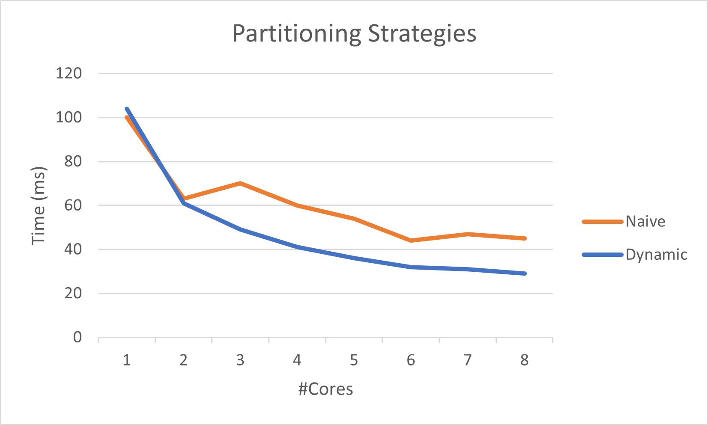

# Lab 1: Partitioning strategies

* _Naive_: The naive partitioning will divide the image row-wise in equally large parts.

* _Dynamic_: The dynamic partitioning will let each thread take a block of 4 rows to compute and once finished the next block in line is computed. A global variable protected with mutex locks keeps track of the current progress of blocks.