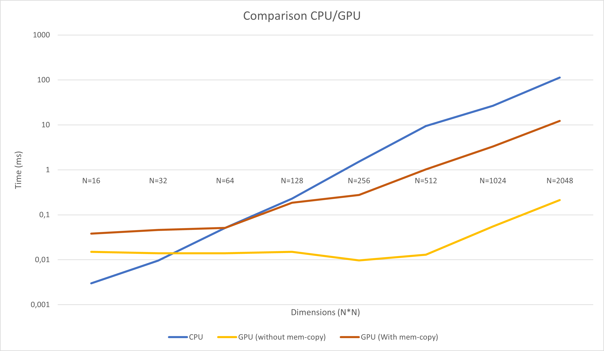

# Lab 4: Introduction to CUDA
## Part 1. Trying out CUDA
### a) Compile and run simple.cu
* How many cores will simple.cu use, max, as written? How many SMs?

    It will use as many cores needed for the specified block size (multiple of available threads), it will launch as many SMs as needed to fit all the blocks. This example utilizes only one SM.

### b) Modifying simple.cu
* Is the calculated square root identical to what the CPU calculates? Should we assume that this is always the case?

    Yes it is, it could maybe vary if the floating point precision is different between the CPU and the device.

## Part 2. Performance and block size
### a) Array computation from C to CUDA
* How do you calculate the index in the array, using 2-dimensional blocks?

    The index can be calculated by using the code snippet:
    `int idx = (threadIdx.x + (threadIdx.y * blockDim.x));`
### b) Larger data set and timing with CUDA Events
* What happens if you use too many threads per block?

    It is unpredictable since there is a limit to the number of threads per block, since all threads of a block are expected to redide on the same CUDA core.

* At what data size is the GPU faster than the CPU?

    For 16x16 threads per block the GPU is faster at N>32 without memcpy and N>64 with memcpys, however the CPU is not multi-threaded.

* What block size seems like a good choice? Compared to what?

    Somewhere in the middle, its program specific.

* Write down your data size, block size and timing data for the best GPU performance you can get.

    N=256, 16x16 threads, 16x16 blocks, 0.0097ms

### c) Coalescing

*  How much performance did you lose by making data accesses non-coalesced?

A little, not so much. For example N=1024 with 16x16 Threads executed in 0.095ms with bad coalescing and 0.055ms with good coalescing.

## Part 3. Mandelbrot revisited

* What were the main changes in order to make the Mandelbrot run in CUDA?

    The main changes were to turn `computeFractal()` and `mandelbrot()` into device functions. We also had to update how the indices were gathered since we removed the nested loops. We also made changes to the draw function since it now had to call the kernel and execute memcpys. Finally, we handled the shared variables between the host and the device with `__managed__`.

* How many blocks and threads did you use?
    
    We used 16x16 threads in each block and 32x32 blocks.

* When you use the Complex class, what modifier did you have to use on the methods?

    `__device__`

* What performance did you get? How does that compare to the CPU solution?

    The CUDA version runs much faster and with much less lag. 
    * GPU: 180 iterations executes in approximately 1.1ms.
    * CPU: 180 iteration executes in approximately 220ms.

* What performance did you get with float vs double precision?

    * GPU: 180 iterations executes in approximately 2.1ms for double precision.
    * CPU: 180 iteration executes in approximately 225ms for double precision.

* In Lab 1, load balancing was an important issue. Is that an issue here? Why/why not?

    No, since we have a large amount of threads and the runtime can launch warps as long as there are avaiable threads.

