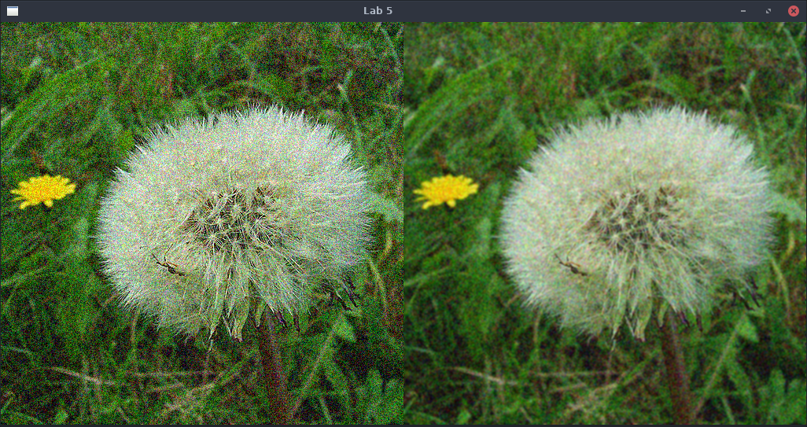
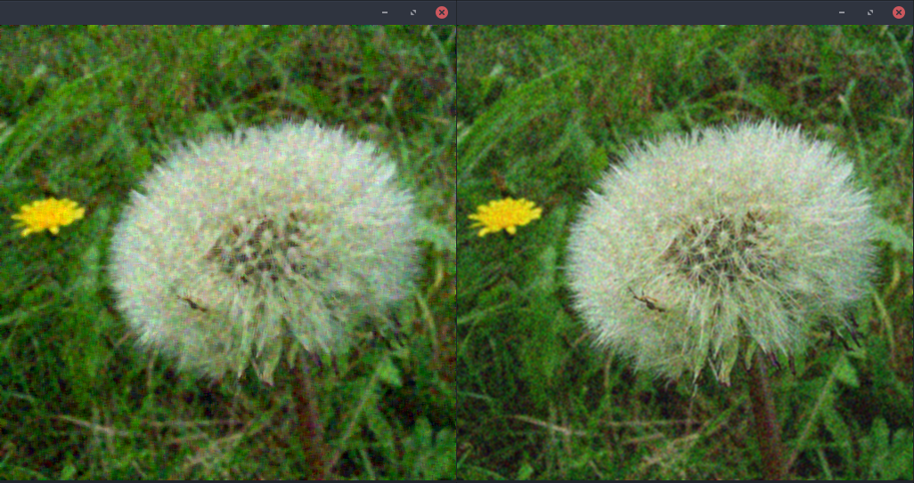
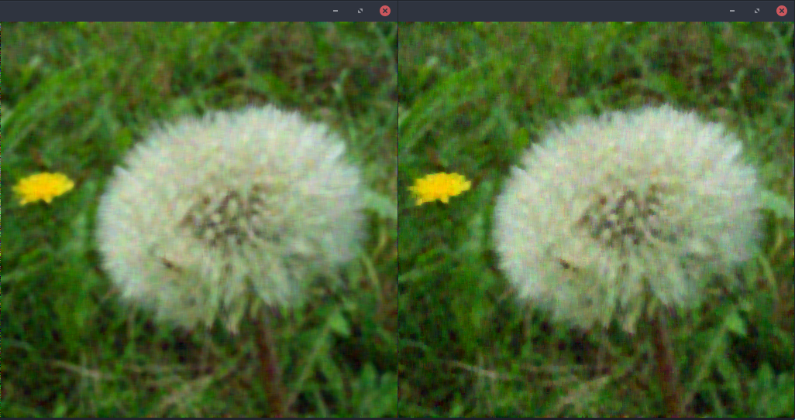
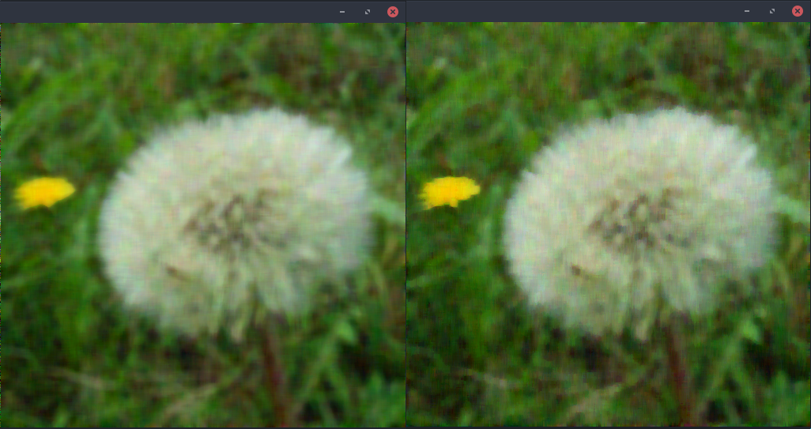

# Lab 5: Image filtering with CUDA and using shared memory
## Part 1. Make a low-pass box filter with shared memory

* How much data did you put in shared memory?

    `maxKernelSizeX*maxKernelSizeY*3`. On our case `maxKernelSizeX = maxKernelSizeY = 32`, total size is 3072 bytes.

* How much data does each thread copy to shared memory?

    1 pixel, 3 bytes.

* How did you handle the necessary overlap between the blocks?

    The overlap is handled by reading pixels in a larger area than what is computed.

* If we would like to increase the block size, about how big blocks would be safe to use in this case? Why?

    CUDA has a maximum of 1024 threads in a block which means 32x32 threads in each block. Using more threads than this will not compile.

* How much speedup did you get over the naive version? For what filter size?

    For the filter size 10x10 the naive version executes in 3.38ms and the improved version executes in 2.03ms.

* Is your access to global memory coalesced? What should you do to get that?

    Yes, because the image is stored in a one dimensional array the memory accesses is coalesced.

## Part 2. Separable LP filter

* How much speedup did you get over the non-separated? For what filter size?

    The separable version executed in 1.78ms for a kernel size 10 (1x10 and 10x1).

## Part 3. Convolution filters with kernel weights, gaussian filters

* Compare the visual result to that of the box filter. Is the image LP-filtered with the weighted kernel noticeably better?

    The gaussian filter produces an image that resembles the original image much closer. When using the box filter much more details are lost compared to using the gaussian filter.

* What was the difference in time to a box filter of the same size (5x5)?

    The separable gaussian filter of sizes 1x5 and 5x1 executes in approximately 0.76ms while the separable box filter of the same sizes executes in 0.71ms.

* If you want to make a weighted kernel customizable by weights from the host, how would you deliver the weights to the GPU?

    For this problem `cudaMemcpy` can be used.

## Part 4. Median filter

* What kind of algorithm did you implement for finding the median?

    The median is found by sorting the array of pixel values with a simple bubble sort.

* What filter size was best for reducing noise?

    Different filter sizes had similar results but the size 5x5 seperable is arguably the best for noise removal.

    
    5x5

* (non-mandatory): Compare the result of the separable and full median filters.

    The images to the left are the 2d filter and the images to the right are the separable versions.
    
    5x5
    
    9x9
    
    13x13

* (non-mandatory): Compare the difference in performance of the separable and full median filters.

