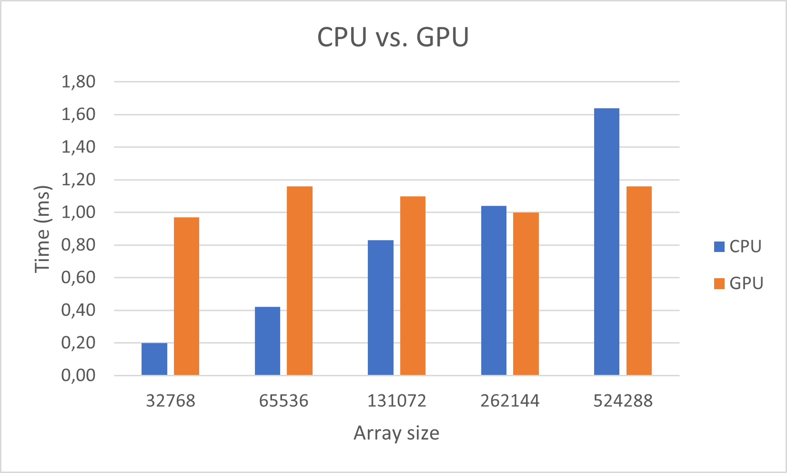

# Lab 6: Reduction and sorting
## Part 1. Getting started: Hello, World!

* How is the communication between the host and the graphic card handled?

    It is handled with OpenCL API calls.

* What function executes your kernel?

    `clEnqueueNDRangeKernel()`.

* How does the kernel know what element to work on?

    By creating buffers and sending it to the kernel as args.

## Part 2. Reduction

* What timing did you get for your GPU reduction? Compare it to the CPU version.

    See graph below.

* Try larger data size. On what size does the GPU version get faster, or at least comparable, to the GPU?

    Around 1048576 to 2097152.
    

* How can you optimize this further? You should know at least one way.

    You could for instance switch from GPU calculations to CPU calculations when the data size is reduced to some threshold.

## Part 3. Bitonic merge sort

* Should each thread produce one output or two? Why?

    Two beacuse it has to compare with another element.

* How many items can you handle in one workgroup?

    2048 since 1024 is the maximum work group size and each thread can produce two outputs.

* What problem must be solved when you use more than one workgroup? How did you solve it?

    The problem of merging must be solved.

* What time do you get? Difference to the CPU? What is the break even size? What can you expect for a parallel CPU version? (Your conclusions here may vary between the labs.)

    The CPU executes faster on small array sizes because of the overhead that is required to copy memory to the GPU and to launch the threads. The break even size is somewhere in between 4096 and 8192.
    

* (non-mandatory) How can you use local memory to optimize? Did your multiple block solution change?

* (non-mandatory) How did your execution time change when using local memory?